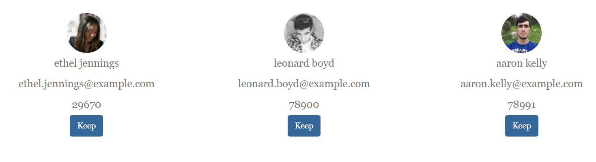

# MERN Practice

Let's try building a MERN application from scratch. In this app, the front-end (built in React) will display three random people courtesy of the randomuser.me API. When the user clicks on the "Keep" button for a corresponding person, it will save certain information about that person in our Mongo database. Then the user will be presented with three new people to select from. The UI should look something like this:

### Hints

* Leverage the boilerplate code from previous activities!

* Start on the back-end and work your way up or start on the front-end and work your way down. It doesn't matter which one you tackle first. Just don't get overwhelmed trying to do both at once.

* Remember, back-end routes can be tested with Postman. Check your Mongo database in Robo 3T to see if data is getting inserted correctly.

* With regards to React, think in small steps. Render a component that says "hello" first and go from there. Don't worry about styling until the core functionality is in place.

* Read the API documentation at [https://randomuser.me/documentation](https://randomuser.me/documentation). There are options in the API to limit how many random people you want to make.